# Git-Training-Aman-Sir

## Branches in git
Branches are an in-built feature in the Git Versioning System. Branches allow you to develop features, fix bugs, or safely experiment with new ideas in a contained area of your repository.


## Creating branches
```bash
git branch <branch_name> 

git branch feature1 #this will create a branch named 'feature1'
```

To see all branches of current repo:

```bash
git branch  #this will display all branches
```

Creating branches with `git checkout`

The other command used to create branches is `git checkout` 

```bash
#syntax
git checkout -b <branch_name> 

#example
git checkout -b feature2 #this will create a branch named 'feature1'
```

## Branching example

* **master**: Represents the production-ready code. All changes eventually merge into `master` after thorough testing.
* **feature**: Used for developing new features or bug fixes.  Allows for isolated development without affecting the stable `master` branch.
* **release**: A temporary branch created from `master` for preparing a release. It allows for final bug fixes or documentation updates before going live.
**dev**: The primary integration branch for ongoing development. Feature branches are merged into `dev` for testing and stabilization before going to `master`.

* The graph visually represents the branching and merging process.
* The different colors likely indicate different branches.
* The tags on the nodes may represent commit hashes or branch names.
* The commands on the left panel document the steps performed.


## Pull request
A Pull Request (PR) is a feature in version control systems like Git that allows developers to propose changes to a repository. It enables collaboration, review, and discussion before merging the changes into the main branch.

If a non collaborator want to make changes in code: he/she needs to fork the repository first:
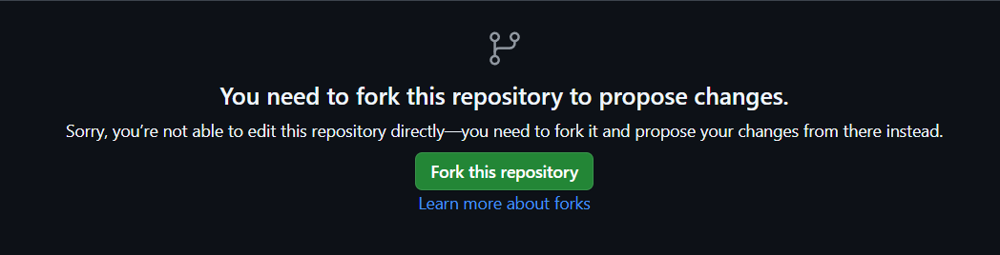

After commiting updates in existing code in forked repo, non-collaborator needs to create a pull request:
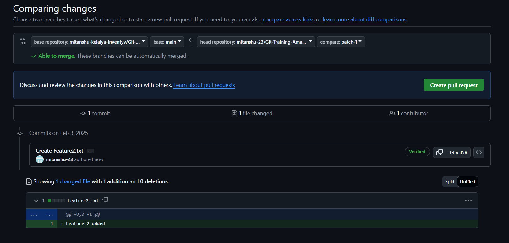

Since there is no code present which conflicts main repo of owner, GitHub allows us to create pull request:
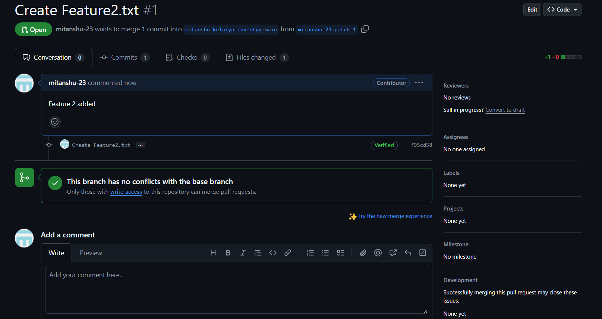

Note: Here it is mentioned that only ones who have write access are allowed to merge pull request.

Now on owner side:
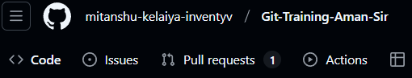

There is a pull request.

Opening pull request:
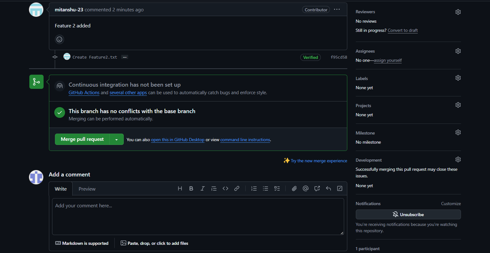

The owner can merge pull request after reviewing it.
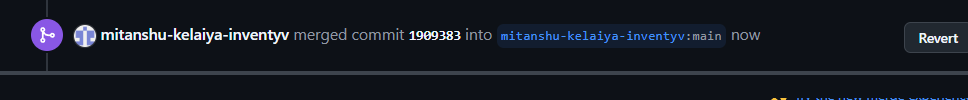

Updated main branch:
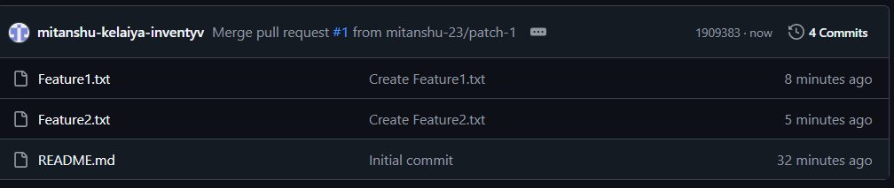


#   Branching Rules
The code owners can manage when should a code actually ge meged in the repo:

In Settings>Branches>Add Branch Ruleset you can add rulesets for your branches:

Give a ruleset name:

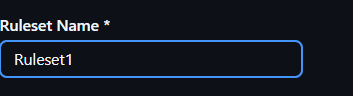

Set the target branches on which you want to apply rules:
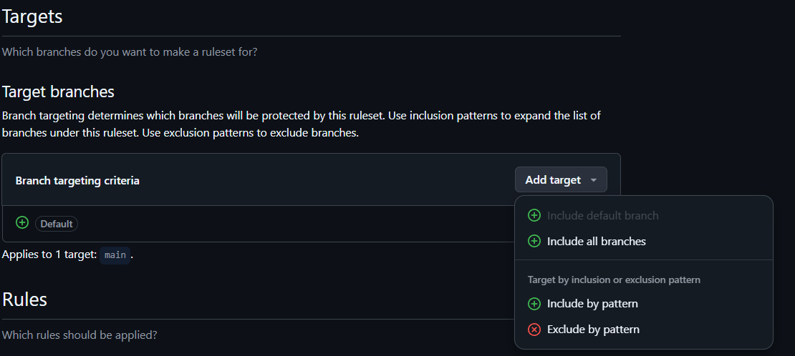

Select required restrictions:
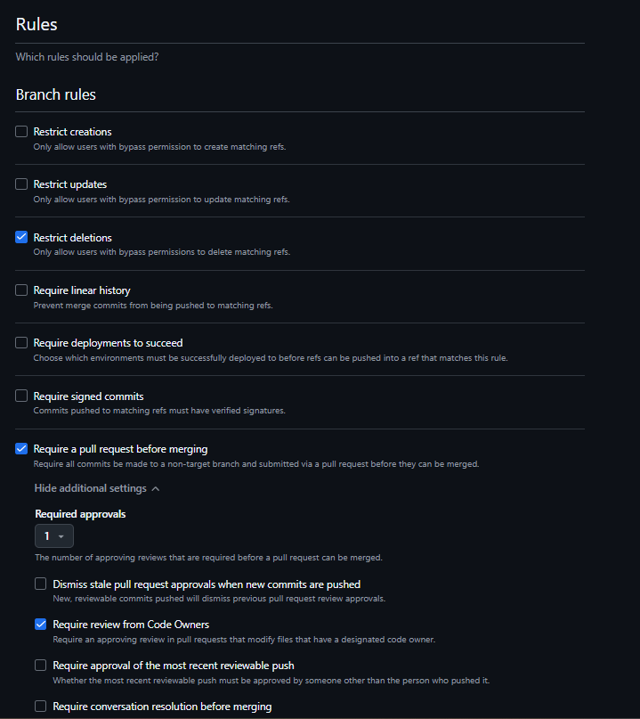
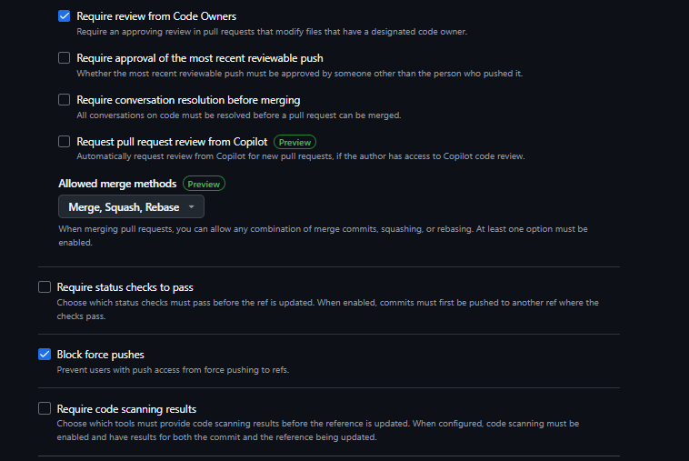